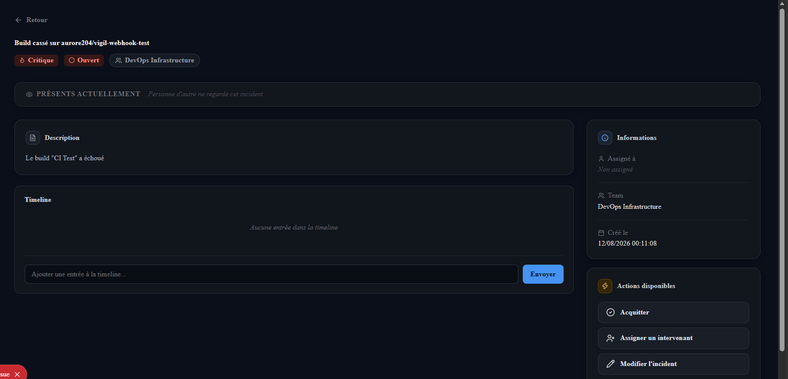
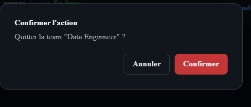

# UI Guidelines — VIGIL

Ce document décrit les règles visuelles et d'accessibilité appliquées dans les deux clients (web et desktop) de VIGIL, ainsi que la manière dont l'application évite les dark patterns.

## 1. Palette de couleurs

VIGIL utilise une palette de 5 couleurs primaires (format `oklch`), chacune avec un usage défini. Aucune couleur n'est utilisée en dehors de son rôle attribué, pour garantir une lecture cohérente sur tous les écrans.

| Couleur | Valeur de référence | Usage |
|---|---|---|
| **Bleu** (action primaire) | `oklch(0.66 0.16 255)` | Boutons principaux, liens actifs, éléments sélectionnés, rôle Manager |
| **Gris neutre** (surface / texte) | `oklch(0.16–0.20 0.015 260)` (fonds) / `oklch(0.55–0.95 0.01 260)` (texte) | Fonds de page, cartes, texte principal et secondaire |
| **Vert** (succès) | `oklch(0.72 0.14 150)` | États résolus/complétés, connexion active, validation |
| **Ambre / Orange** (avertissement) | `oklch(0.78–0.82 0.14 60–85)` | Sévérité moyenne/élevée, états d'escalade, actions d'automatisation |
| **Rouge** (danger) | `oklch(0.55–0.78 0.15–0.18 25)` | Actions destructives, sévérité critique, erreurs, bannissements |

Règle générale : une seule couleur d'accent est utilisée à la fois par composant interactif (jamais de dégradé multicolore sur un même bouton), et le rouge est **exclusivement réservé** aux actions destructives ou aux états critiques — il n'est jamais utilisé comme couleur décorative.

## 2. Hiérarchie typographique

Trois niveaux de texte sont utilisés de façon constante sur tout l'écran :

| Niveau | Taille | Poids | Exemple d'usage |
|---|---|---|---|
| **Titre** | 22–26px | 700 (gras) | Nom de la page, titre d'un incident/release |
| **Sous-titre / en-tête de section** | 11–13px, majuscules, espacement de lettres | 700 | En-têtes de carte ("INFORMATIONS", "ÉTAPES", "MEMBRES") |
| **Corps** | 12–14px | 400–600 | Texte courant, labels de formulaire, contenu des messages |

La police utilisée dans toute l'application est **Inter** (system-ui en repli), à l'exception d'un bug connu et non corrigé sur le layout racine où `body` utilise encore `Times New Roman` par erreur d'héritage CSS — signalé mais non bloquant pour la version actuelle.

## 3. Grille d'espacement

Les espacements suivent une échelle régulière basée sur des multiples de 4px : `4, 6, 8, 10, 12, 14, 16, 18, 20, 24, 28, 32px`. Les cartes utilisent un padding de 18–24px, les listes un espacement interne de 12–16px entre éléments. Les rayons de bordure suivent aussi une échelle cohérente : 6–9px pour les éléments interactifs (boutons, champs, badges), 12–14px pour les cartes et conteneurs.

## 4. Mapping état → représentation visuelle

Chaque état métier est représenté par la **combinaison** couleur + icône + texte, jamais par la couleur seule (voir section Accessibilité).

### États d'incident
| État | Couleur | Icône |
|---|---|---|
| `open` | Rouge | Cercle |
| `acknowledged` | Bleu | Coche |
| `escalated` | Ambre | Flèche vers le haut |
| `resolved` | Vert | Coche |

### Sévérité
| Niveau | Couleur | Icône |
|---|---|---|
| `low` | Vert | Info |
| `medium` | Ambre | Triangle d'alerte |
| `high` | Orange | Triangle d'alerte |
| `critical` | Rouge | Flamme |

### États de release
| État | Couleur | Icône |
|---|---|---|
| `created` | Gris | Carré |
| `in_progress` | Bleu | Flèches de rafraîchissement |
| `completed` | Vert | Coche |
| `cancelled` | Gris | Croix |
| `blocked` | Rouge | Cadenas |

## 5. Composants réutilisables

| Composant | Variantes | Description |
|---|---|---|
| **Button** | `primary`, `secondary`, `danger`, `ghost` | État de chargement intégré (spinner), désactivation visuelle claire |
| **Badge** | `IncidentStateBadge`, `SeverityBadge`, `ReleaseStateBadge`, `RoleBadge` | Toujours icône + couleur + texte |
| **Modal** | — | Conteneur standard pour formulaires de création |
| **ConfirmDialog** | — | Utilisé systématiquement pour toute action destructive (voir section Dark Patterns) |
| **Input** | avec `label` et `hint` optionnel | Jamais de champ affiché sans label explicite |
| **Toast** | `success`, `error`, `warning`, `info` | Notifications non bloquantes, dédupliquées par utilisateur pour éviter le bruit |
| **Carte à en-tête iconique** | — | Pattern utilisé pour toutes les cartes secondaires (Informations, Actions, Détails) : icône colorée dans un cadre + titre de section |

Deux écrans effectuant une action similaire (ex : créer un incident vs créer une release) partagent la même structure de formulaire, les mêmes composants `Input`/`Button`/`Modal`, et le même pattern de validation.

## 6. Dark patterns : identification et mitigation

Conformément à l'exigence du cahier des charges, l'interface a été auditée pour éviter les pratiques suivantes :

- **Confirmation obligatoire sur toute action destructive.** Le composant `ConfirmDialog` est utilisé systématiquement pour : suppression d'incident, kick, ban temporaire/permanent, annulation de release, transfert du rôle Manager, suppression de team. Chaque dialogue **nomme explicitement la ressource concernée** (ex : *"Bannir Dominique de la team ?"*), jamais de confirmation générique.
- **Pas d'inversion de confirmation.** Le bouton d'annulation dit toujours "Annuler" et le bouton de confirmation reprend toujours le nom de l'action ("Supprimer", "Bannir", "Transférer") — jamais de formulation piégeuse type "Cliquer ici pour NE PAS annuler".
- **Pas d'option critique cachée.** Toutes les actions destructives sont visuellement identifiables (couleur rouge, icône dédiée) et accessibles au même niveau que les actions non destructives, jamais dissimulées dans un sous-menu non évident.

## 7. Accessibilité

Niveau ciblé : conformité aux critères minimaux définis par le cahier des charges, avec une attention portée aux utilisateurs daltoniens et à la navigation clavier.

- **Navigation clavier** : toutes les actions primaires (créer un incident, acquitter, escalader, valider une étape de release) sont des éléments `<button>` natifs, focusables et activables au clavier. Le composant `ConfirmDialog` place automatiquement le focus sur le bouton d'annulation à l'ouverture, et se ferme sur `Escape`.
- **Labels explicites** : tous les champs de formulaire utilisent le composant `Input` avec une prop `label` obligatoire — aucun champ ne repose uniquement sur un `placeholder` pour indiquer sa fonction.
- **Redondance de l'information de couleur** : chaque état (incident, sévérité, release) est communiqué par trois canaux simultanés — couleur, icône, texte — afin de rester lisible pour les utilisateurs daltoniens (voir section 4).
- **Attributs ARIA** : les icônes purement décoratives portent `aria-hidden="true"`, les boutons d'action sans texte visible (ex : mode réduit de la barre latérale) portent un `aria-label` ou `title` explicite.

## 8. Captures annotées

 *Page de détail d'un incident
 
**[Capture 2 — à insérer]** *Boîte de dialogue de confirmation (`ConfirmDialog`) *

---
*Document rédigé dans le cadre du projet VIGIL — Epitech T-DEV-600.*